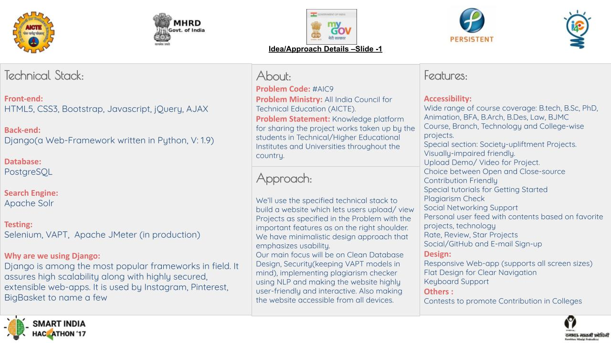
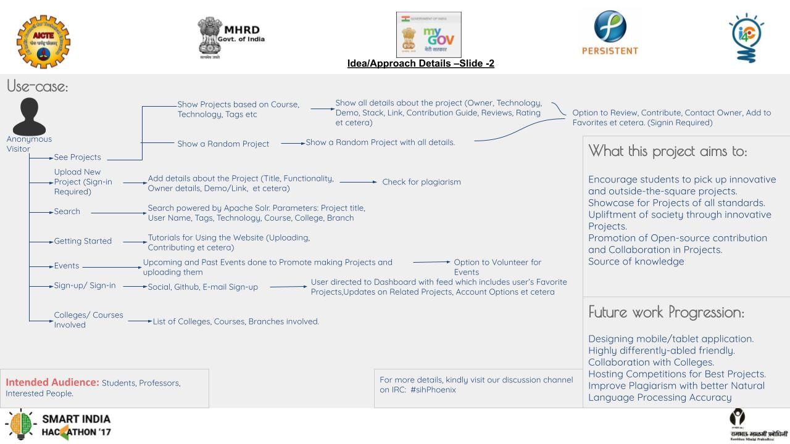

# Project_SIH    
#### Problem Statement 
Many good initiatives by students in the form of project is presently going   un-noticed because of lack of awareness. If a common knowledge platform (with a facility for plagiarism) is created to bring all project works taken up at various levels by the students in Technical  / Higher Educational Institutes and Universities throughout the country , then it will be a great source of knowledge and also will help the student community to take up unique/innovative project works.Provision of Knowledge platform in which the entire data base of all the projects taken up by all Technical/Higher Educational Institutes/ Universities throughout the country by interlinking will be extremely useful.

##### Title of The project
Knowledge platform for sharing the project works taken up by the students in Technical/Higher Educational Institutes and Universities throughout the country

#### Team Members
[Sachin](http://github.com/suresach)  
[Mannu](http://github.com/theparadoxer02)    
[Puneet](http://github.com/)    
[Shweta](http://github.com/cosmologist10)        

   
    

